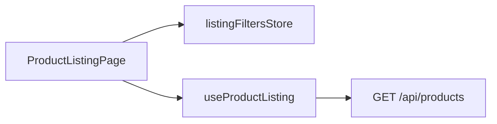

# StyleWare — e-commerce de moda e varejo (demo)

Repositório e pasta raiz: **`ecommerce-modavarejo`** (igual ao nome no `package.json`).

**Demo (Vercel — front):** https://ecommerce-modavarejo.vercel.app

O catálogo em produção pode ser servido por uma **API hospedada à parte** (ex.: Railway). Configure **`VITE_API_URL`** no projeto da Vercel com a **origem** da API (ex.: `https://seu-servico.up.railway.app`), **sem** barra no fim. O build do Vite embute esse valor no cliente; o **`middleware.ts`** na raiz também usa `VITE_API_URL` no edge para buscar HTML de preview (ver secção **SEO e previews sociais** abaixo).

Na Vercel, rotas do React Router (ex.: `/favoritos`, `/produto/...`) precisam de **rewrite** para `index.html`; o arquivo [`vercel.json`](vercel.json) na raiz faz isso. Sem ele, abrir essas URLs diretamente no navegador retorna 404; navegar pelos links internos continua funcionando.

**Apresentação (roteiro em tópicos):** [`docs/roteiro-apresentacao.md`](docs/roteiro-apresentacao.md)

Aplicação front-end de catálogo e carrinho alinhada ao **case técnico Moda & Varejo**: categorias **masculino**, **feminino** e **acessórios**, com **condição comercial** explícita em cada produto (**novo**, **usado**, **excelente estado**), filtros na PLP e badges na vitrine e na PDP.

Stack: **React 19**, **Vite**, **TypeScript**, **Tailwind CSS v4** e **React Router 7**. O catálogo vem de uma **API REST local** (`server/`, Express) que reutiliza o mesmo mock TypeScript do front; em desenvolvimento o Vite **proxy** encaminha `/api` para a API (padrão `http://localhost:3001` se você sobe só `dev:api`; **`npm run dev:full` usa a porta 3031** para evitar conflito com outro processo na 3001). O foco é arquitetura, estado global e UX **mobile-first**.

**Imagens do catálogo:** fotos reais de moda via [Unsplash](https://unsplash.com) (URLs estáveis no mock em [`src/features/products/mock/plp-mock.ts`](src/features/products/mock/plp-mock.ts)); atribuição às licenças dos fotógrafos conforme as regras da plataforma.

---

## Arquitetura

O código segue uma separação por camadas e por **feature**:

| Pasta | Papel |
|-------|--------|
| `src/app/` | Composição da aplicação: rotas, layout, providers globais. |
| `src/features/` | Domínio por pasta (`products`, `cart`, `checkout`, `admin`): páginas, componentes de feature, hooks e **stores** do domínio. |
| `src/ui/` | Componentes de interface reutilizáveis (botão, breadcrumb, estados vazios/erro, etc.). |
| `src/components/` | Composição compartilhada que não é “primitivo” de UI (ex.: `ProductCard`). |
| `src/types/` | Tipos de domínio compartilhados (`Product`, `CartLine`, …). |
| `src/lib/` | Utilitários, rotas centralizadas, HTTP client, formatação. |
| `src/hooks/` | Hooks genéricos reutilizáveis. |
| `server/` | API Express (TypeScript): catálogo, pedidos e CRUD de produtos no admin; importa mock e regras do `src/` para uma única fonte de dados. |

Fluxo típico na listagem de produtos (PLP):



Rotas centralizadas em [`src/lib/routes.ts`](src/lib/routes.ts) para evitar strings mágicas espalhadas.

---

## Decisões técnicas

- **React Router 7** com layout aninhado (`MainLayout` + `Outlet`), `ScrollRestoration` para posição de rolagem consistente entre telas, e breadcrumbs declarativos por página (sem acoplamento à store).
- **Zustand** com `persist`:
  - **Filtros PLP** — `ecommerce-modavarejo:plp-filters` (categoria, marca, ordenação, **condição comercial** e texto de **busca** `q`). A chave foi trocada em relação a versões antigas do mock para não reidratar categorias incompatíveis.
  - **Carrinho** — `ecommerce-modavarejo:cart`; migração automática de JSON legado em formato de **array** de linhas para o formato persistido do Zustand.
  - **Favoritos** — lista de IDs em `ecommerce-modavarejo:favorites`.
- **Carrinho**: substituição do **Context + serviço + `useSyncExternalStore`** por uma única store; `useCart()` mantém a mesma API pública para os consumidores, usando `useShallow` para evitar re-renders desnecessários.
- **Modal de filtros (mobile)** implementado com **`<dialog>` nativo** (`showModal` / `close`), com rótulos ARIA e botão de fechar explícito; no desktop os filtros ficam inline a partir do breakpoint `md`.
- **Framer Motion** concentrado em transições de layout e microinterações já existentes; não há dependência de motion para regras de negócio. **`prefers-reduced-motion`**: transições de página (layout) e bloco principal da PDP ficam instantâneas quando o usuário pede menos movimento.
- **Desacoplamento**: `ProductCard` (`src/components`) aceita `topAction` opcional; o botão de favorito vive em `features/products` e é injetado pelo grid, evitando dependência circular entre camadas.
- **PLP e query string**: [`useProductListingUrlSync`](src/features/products/hooks/useProductListingUrlSync.ts) mantém filtros alinhados à URL (`category`, `brand`, `sort`, `condition`, `q`). O campo **Buscar** na toolbar usa **debounce** (~300 ms) antes de atualizar a store e a URL, reduzindo requisições. Se a página abre **com** parâmetros válidos, eles prevalecem sobre o que estiver no `localStorage` após a reidratação do Zustand. Voltar o histórico para `/` sem query restaura filtros “limpos”.
- **SEO na PDP (cliente)**: [`useProductDetailSeo`](src/features/products/hooks/useProductDetailSeo.ts) injeta metas Open Graph e Twitter, `canonical`, JSON-LD `Product` e restaura título/descrição ao sair. Isso vale para quem **executa JavaScript** no browser.
- **Acessibilidade**: link **“Pular para o conteúdo”** no topo do layout aponta para `#conteudo-principal` (`main`, focável com `tabIndex={-1}`).
- **Backend**: Express em [`server/src/index.ts`](server/src/index.ts); CORS liberado para dev. O front chama caminhos relativos `/api/...` (proxy Vite) ou, em produção, use `VITE_API_URL` com a origem da API.
- **Detalhe por id**: `GET /api/product/:id` para carrinho e checkout (evita ambiguidade com slugs numéricos em `GET /api/products/:slug`).
- **PDP e conversão (Tech Challenge 2026)**: galeria com zoom na área principal (desktop), painel ampliado ao lado, modal em tela cheia com navegação; abas **Descrição / Especificações / Trocas e devoluções**; preço “De” opcional (`compareAtPriceCents`) com selo **Economize R$ …**; reforço de escassez (“Últimas unidades”); **produtos relacionados** na mesma categoria (`GET /api/products/:slug/related`); breadcrumbs com link de volta à PLP filtrada por categoria.
- **Mini-carrinho**: ao **adicionar** um item, abre-se automaticamente uma gaveta (`<dialog>`): resumo das linhas, subtotal e atalhos para o carrinho e o checkout — o badge no header continua como atalho rápido.
- **Privacidade (cookies)**: banner com consentimento armazenado em `localStorage` (`ecommerce-modavarejo:cookie-consent`).
- **Docker**: [`Dockerfile.api`](Dockerfile.api) (API Node + `tsx`), [`Dockerfile.web`](Dockerfile.web) (build Vite + **nginx**), [`docker-compose.yml`](docker-compose.yml) e [`docker/nginx.conf`](docker/nginx.conf) (SPA + proxy de `/api` para o serviço `api`). O nginx identifica **User-Agents** de redes sociais em `/produto/:slug` e devolve HTML com Open Graph gerado pela API (mesma ideia do middleware da Vercel). Subir tudo: `docker compose up --build` e abrir `http://localhost:8080` (API também mapeada em `http://localhost:3031`).

---

## SEO e previews sociais (WhatsApp, Open Graph)

Crawlers (WhatsApp, Facebook, etc.) **não executam** o React; só veem o **primeiro HTML**. Por isso existem **dois** caminhos:

1. **No browser**, após o JS carregar, [`useProductDetailSeo`](src/features/products/hooks/useProductDetailSeo.ts) preenche título, descrição, OG, Twitter e JSON-LD na PDP.
2. **Para crawlers**, a API expõe **`GET /internal/social-pdp/:slug`**, que devolve uma página HTML mínima só com metas (`og:title`, `og:image`, …) e dados do produto.
   - **Vercel:** [`middleware.ts`](middleware.ts) na raiz detecta User-Agent social em `/produto/:slug`, chama a API com `X-Forwarded-Host` / `X-Forwarded-Proto` e devolve esse HTML. Exige **`VITE_API_URL`** configurado no projeto da Vercel.
   - **Docker (nginx):** regra equivalente em [`docker/nginx.conf`](docker/nginx.conf) encaminha para a mesma rota interna da API.

**Variáveis úteis**

| Onde | Variável | Uso |
|------|----------|-----|
| Build do front (Vercel, `.env` local) | `VITE_API_URL` | Origem da API para `fetch` no cliente e para o middleware na Vercel. |
| API (Docker Compose) | `PUBLIC_SITE_URL` | Opcional; canonical e `og:url` nas respostas HTML se o `Host` do proxy não refletir o domínio público. |

**Testar:** com User-Agent de rede social, a resposta de `/produto/<slug>` deve conter `og:image`. O [Sharing Debugger](https://developers.facebook.com/tools/debug/) da Meta ajuda a **invalidar cache** de preview; o WhatsApp pode atrasar atualização em relação ao `curl`.

---

## API REST (implementada + entregável opcional do case)

O PDF do desafio cita como **opcional** uma breve descrição ou diagrama de backend e API. A implementação abaixo corresponde ao contrato usado pelo front, alinhada ao tipo [`Product`](src/types/product.ts):

| Método | Caminho | Query / notas |
|--------|---------|----------------|
| `GET` | `/api/products` | `category`, `brand` (slug), `sort` (`name-asc`, `name-desc`, `price-asc`, `price-desc`), opcional `condition` (`novo`, `usado`, `excelente`), opcional `q` (busca em nome/descrição). Resposta: `{ "items": Product[] }`. |
| `GET` | `/api/products/:slug` | Retorna um `Product` ou `404`. |
| `GET` | `/internal/social-pdp/:slug` | Resposta **`text/html`** com metas Open Graph / Twitter para crawlers (WhatsApp, etc.). Não é JSON; usada pelo nginx Docker e pelo fluxo de preview na Vercel. |
| `GET` | `/api/products/:slug/related` | `limit` (1–12, padrão 4). Produtos da mesma `category`, excluindo o slug. Resposta: `{ "items": Product[] }`. |
| `GET` | `/api/product/:id` | Retorna um `Product` por `id` ou `404`. |
| `POST` | `/api/orders` | Corpo: `{ "lines": [{ "productId", "quantity" }], "delivery": { "cep", "city", "address" }, "paymentMethod": "card" \| "pix" \| "boleto" }`. Valida endereço (CEP 8 dígitos **ou** cidade + endereço). Resposta `201`: pedido com `id`, `subtotalCents`, linhas com preços do catálogo. |
| `GET` | `/api/orders/:id` | Retorna o pedido ou `404`. Pedidos ficam em **memória** na API (reinício apaga o histórico). |
| `GET` | `/api/brands` | Lista marcas para filtros. |
| `POST` | `/api/products` | Cria produto (admin). |
| `PUT` | `/api/product/:id` | Atualiza produto por id (admin). |
| `DELETE` | `/api/product/:id` | Remove produto (admin). |

**Exemplo de item** (campos principais; `imageUrl` e `galleryUrls` usam URLs do Unsplash no mock):

```json
{
  "id": "1",
  "slug": "camiseta-basica-algodao-m",
  "name": "Camiseta básica algodão orgânico",
  "description": "Modelagem regular…",
  "priceCents": 79900,
  "category": "masculino",
  "condition": "novo",
  "brand": "Linha do Sul",
  "brandSlug": "linha-do-sul",
  "imageUrl": "https://images.unsplash.com/photo-…",
  "galleryUrls": ["https://images.unsplash.com/photo-…"],
  "stock": 24,
  "rating": 4.7,
  "reviewCount": 186,
  "specifications": [{ "label": "Tamanho", "value": "M" }]
}
```

---

## Como rodar

Requisitos: **Node.js** compatível com Vite 8 (recomendado: Node 20+).

Na raiz do projeto:

```bash
npm install
cd server && npm install && cd ..
```

**Só o front (a requisição a `/api` falhará sem a API):**

```bash
npm run dev
```

**Front + API (recomendado):** dois terminais **ou** um comando:

```bash
npm run dev:full
```

- Vite: `http://localhost:5173` (proxy `/api` → `http://127.0.0.1:3031`).
- API: `http://localhost:3031` nesse fluxo.

**Docker (reprodutibilidade):** na raiz, com Docker instalado:

```bash
docker compose up --build
```

- Front: `http://localhost:8080` (nginx serve o `dist` e encaminha `/api` ao container da API).
- API: `http://localhost:3031` (também acessível na rede interna do Compose como hostname `api`).

**Só a API** (`npm run dev:api`) continua na **3001** por padrão. Se aparecer `EADDRINUSE`, outro programa (ou uma API antiga) está usando essa porta: encerre esse processo **ou** suba em outra porta e alinhe o proxy, por exemplo:

```bash
cross-env PORT=3031 npm run dev:api
# noutro terminal:
cross-env VITE_API_PROXY_TARGET=http://127.0.0.1:3031 npm run dev
```

Abra o endereço exibido pelo Vite no terminal.

**Produção (front + API separados):** crie um arquivo `.env.production` ou configure as variáveis no painel da Vercel: `VITE_API_URL=https://origem-da-sua-api`. Sem isso, o front em produção não encontra `/api` (não há proxy do Vite). Após alterar `VITE_*`, é necessário **novo build**.

Outros scripts:

```bash
npm run build       # TypeScript + build de produção
npm run preview     # Servir pasta dist
npm run lint        # ESLint
npm run test        # Vitest (unitário)
npm run test:e2e    # Playwright (sobe Vite **9264** + API **9281**; não usa 3031/3001 do seu `dev`)
```

Para E2E pela primeira vez: `npx playwright install chromium`.

**CI (GitHub Actions):** em cada push/PR para `main` ou `master`, o workflow [`.github/workflows/ci.yml`](.github/workflows/ci.yml) executa `npm run test` e `npm run build` (com dependências do `server/` instaladas para o TypeScript do projeto). E2E continua opcional e local via `npm run test:e2e`. O `npm run lint` pode ser executado localmente antes de subir alterações.

---

## Rotas principais

| Rota | Descrição |
|------|-----------|
| `/` | PLP — listagem; filtros em **query** opcionais: `category`, `brand`, `condition`, `sort`, `q` (ex.: `/?category=feminino&condition=novo&q=linho&sort=price-asc`). |
| `/produto/:slug` | PDP — detalhe, galeria, favorito e carrinho. |
| `/favoritos` | Lista de favoritos persistidos (catálogo filtrado por ID). |
| `/carrinho` | Carrinho persistido. |
| `/checkout` | Checkout com endereço e método de pagamento; envia `POST /api/orders`. |
| `/pedido/:orderId` | Confirmação do pedido criado. |
| `/admin` | Listagem de produtos (admin). |
| `/admin/novo` | Formulário de novo produto. |
| `/admin/editar/:id` | Edição de produto existente. |

---

## Melhorias futuras

- **TanStack Query** para cache, retry e estados de loading/error com a API real.
- Mais testes (RTL em componentes de UI) e auditoria **a11y** formal (axe).
- **PWA**, **i18n** e favoritos sincronizados com backend após autenticação.

---

## Licença

Código de **demonstração** para processo seletivo. O campo `private: true` no `package.json` evita publicação acidental no npm.

Imagens: **Unsplash** — respeite a [licença Unsplash](https://unsplash.com/license) ao reutilizar ou atribuir.
